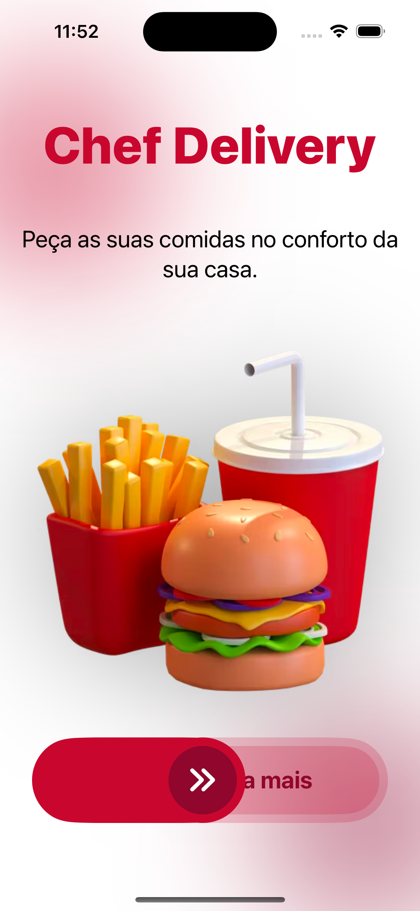
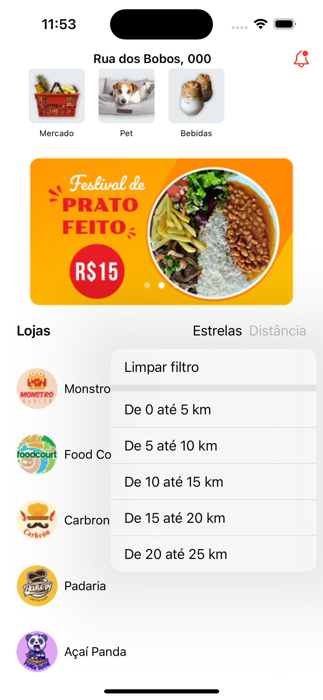
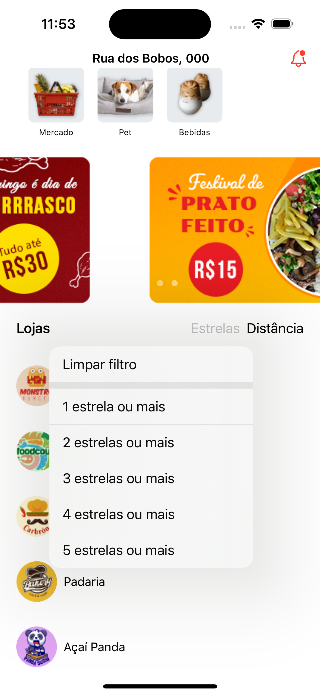
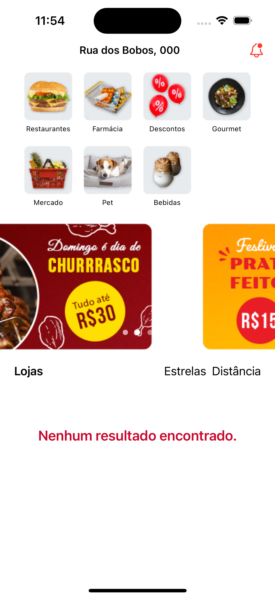
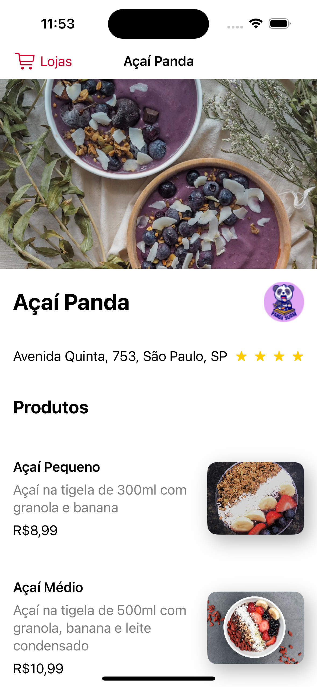
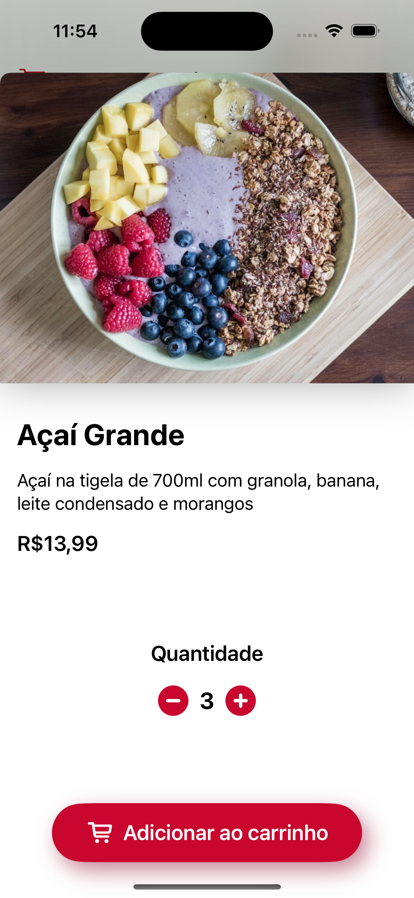

<div >
  
</div>

<p align="center">
	<a href="https://www.linkedin.com/in/wesley-andrade/">	
		
	</a>
	<a href="https://choosealicense.com/licenses/mit/">	
		
	</a>
</p>

<p align="center">
  <a href="#projeto">Projeto</a>&nbsp;&nbsp;&nbsp;|&nbsp;&nbsp;&nbsp;
  <a href="#layout">Layout</a>&nbsp;&nbsp;&nbsp;|&nbsp;&nbsp;&nbsp;
  <a href="#tecnologias">Tecnologias</a>&nbsp;&nbsp;&nbsp;|&nbsp;&nbsp;&nbsp;
  <a href="#instalação">Instalação</a>&nbsp;&nbsp;&nbsp;|&nbsp;&nbsp;&nbsp;
  <a href="#scroll-certificados">Certificados</a>&nbsp;&nbsp;&nbsp;|&nbsp;&nbsp;&nbsp;
  <a href="#page_with_curl-licencia">Licencia</a>
</p>

## Projeto

O Chef Delivery é um projeto idealizado pela 
<a href="https://alura.com.br/"> **Alura** </a> 
com a intensão de criar uma interface de um app IOS de delivery de comida.

Assuntos abordados:

- [x] UIKit vs Swift UI e o modelos imperativo e declarativo;
- [x] Componentes com HStack e VStack;
- [x] Carrossel com TabView;
- [x] Navegação entre telas em SwiftUI;
- [x] Telas interativas;
- [x] Gerenciador de estado @State;
- [x] Filtros;
- [x] Fundamentos das animações no SwiftUI;
- [x] Implementação do DragGesture para interações de arrastar;
- [x] Efeitos de transição;

## Layout
<div style="display: flex; flex-direction: 'row'; align-items: 'center';">
	
	
	
	
	
	
</div>

## Tecnologias

- [Swift UI](https://www.swift.org/)

## Instalação

```bash
# Clone do Repositorio
$ git clone https://github.com/WesleyReboucas/ChefDelivery.git
```

```bash
# Na pasta ChefDelivery
$ cd ChefDelivery

```


## :scroll: Certificados 

<a href="https://cursos.alura.com.br/certificate/2ca04c07-6dfc-4e4d-a344-b87a32ce6c6c?lang=pt_BR">
	
</a>

<a href="https://cursos.alura.com.br/certificate/2ca04c07-6dfc-4e4d-a344-b87a32ce6c6c?lang=pt_BR">
	
</a>


## :page_with_curl: Licencia 
<div>
  Esse projeto está sob a licença MIT.   
</div>
<a href="https://choosealicense.com/licenses/mit/">
	
</a>


---

Feito com ♥ by Wesley Rebouças


